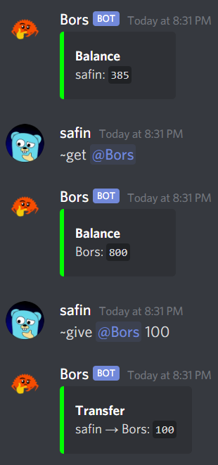

<p align="center" width="400px">
    
</p>

<p align="center">
    <i>A virtual currency bot for Discord</i>
    <hr />
</p>

## 🦀 Features

Bors is a robust, fast, and thread-safe Discord bot built with Rust. It features:

- A fully-fleshed-out currency system, with support for:
  - Retrieving a user's balance
  - Transferring coins
  - Retrieving a global leaderboard
- A persistent and performant embedded database (with [sled](https://github.com/spacejam/sled))
  - User balances are stored across Discord Guilds (Servers)
- A simple environment-variable based custom logger
- An awesome abstracted command system, thanks to [serenity](https://github.com/serenity-rs/serenity)!

## ✨ In Action

<p align="center" width="250px">
    
</p>

## 🛠️ Usage

Bors is extremely easy to set up and host:

```sh
# 1. clone the repository
git clone https://github.com/safinsingh/bors

# 2. set up token
echo "TOKEN=MY_BOT_TOKEN" >.env

# 3. build for release
cargo build --release -vv
cp target/release/bors .

# 4. run!
LOG= ./bors
```

## 🔮 Contributing

If you feel like you can make a meaningful contribution to `bors`, feel free to fork this repository and create a [pull request](https://github.com/safinsingh/bors/pulls)! Feature requests and bugs can be filed within the [issues](https://github.com/safinsingh/bors/issues) tab.

## 👨‍💻 Authors

- [Safin Singh](https://safin.dev)
